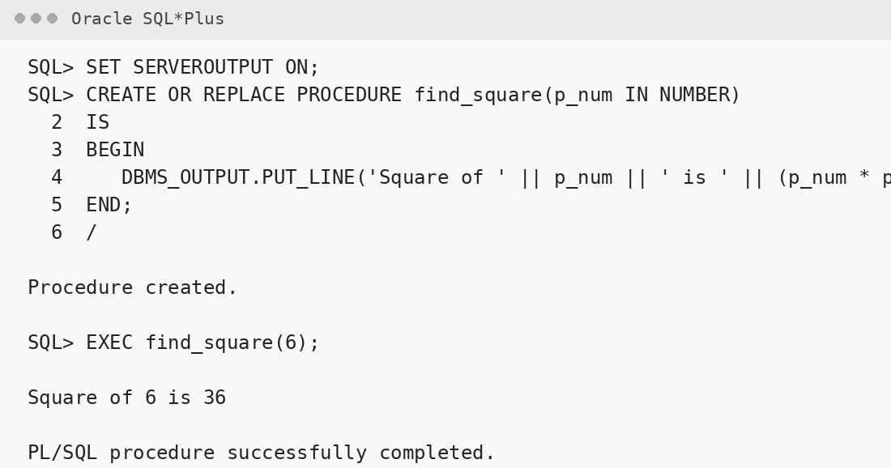
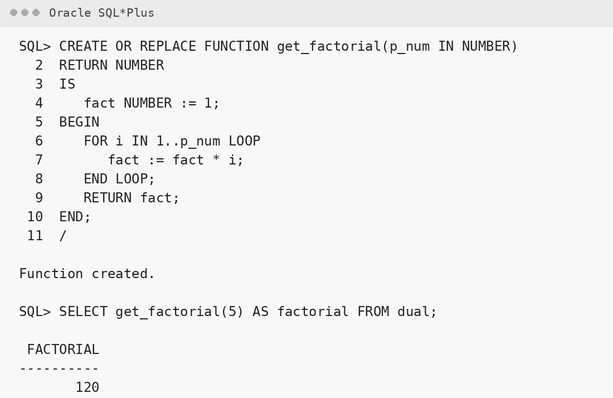
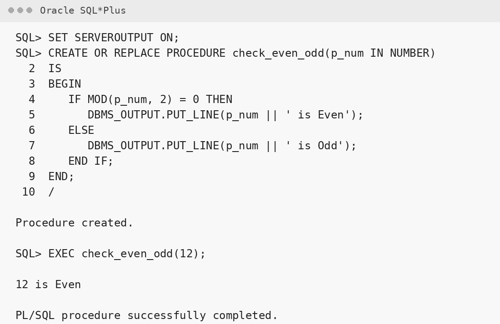
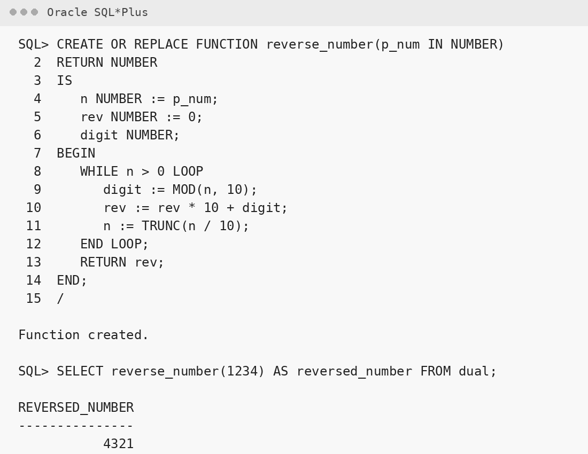
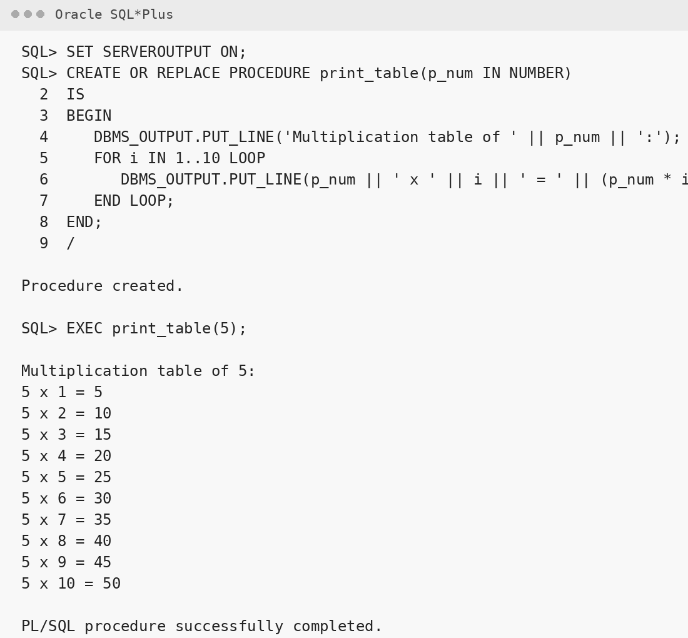

# Experiment 9: PL/SQL – Procedures and Functions

## AIM

To understand and implement procedures and functions in PL/SQL for performing various operations such as calculations, decision-making, and looping.

---

## THEORY

PL/SQL (Procedural Language/SQL) extends SQL by adding procedural constructs like variables, conditions, loops, procedures, and functions. Procedures and functions are subprograms that help modularize the code and improve reusability.

### **Procedure**

A PL/SQL **procedure** is a subprogram that performs a specific action. It does not return a value directly but can return values using `OUT` parameters.

**Syntax:**

```sql
CREATE OR REPLACE PROCEDURE procedure_name (parameters)
IS
BEGIN
   -- statements
END;
/
```

To call the procedure:

```sql
EXEC procedure_name(arguments);
```

### **Function**

A PL/SQL **function** is a subprogram that returns a single value using the RETURN keyword.

```sql
CREATE OR REPLACE FUNCTION function_name (parameters)
RETURN datatype
IS
BEGIN
   -- statements
   RETURN value;
END;
/
```

To call the function:

```sql
SELECT function_name(arguments) FROM DUAL;
```

**Key Differences:**

- A procedure does not return a value, whereas a function must return a value.
- Functions can be called from SQL queries, procedures cannot (in most cases).

---

## 1. Write a PL/SQL Procedure to Find the Square of a Number

### Steps:

- Create a procedure named `find_square`.
- Declare a parameter to accept a number.
- Inside the procedure, compute the square of the input number.
- Use `DBMS_OUTPUT.PUT_LINE` to display the result.
- Call the procedure with a number as input.

**Expected Output:**
Square of 6 is 36

**Program:**

```sql
SET SERVEROUTPUT ON;

CREATE OR REPLACE PROCEDURE find_square(p_num IN NUMBER)
IS
BEGIN
   DBMS_OUTPUT.PUT_LINE('Square of ' || p_num || ' is ' || (p_num * p_num));
END;
/

EXEC find_square(6);
```

**Output:**



---

## 2. Write a PL/SQL Function to Return the Factorial of a Number

### Steps:

- Create a function named `get_factorial`.
- Declare a parameter to accept a number.
- Use a loop to calculate the factorial.
- Return the result using the `RETURN` statement.
- Call the function using a `SELECT` statement or in an anonymous block.

**Expected Output:**
Factorial of 5 is 120

**Program:**

```sql
CREATE OR REPLACE FUNCTION get_factorial(p_num IN NUMBER)
RETURN NUMBER
IS
   fact NUMBER := 1;
BEGIN
   FOR i IN 1..p_num LOOP
      fact := fact * i;
   END LOOP;
   RETURN fact;
END;
/

SELECT get_factorial(5) AS factorial FROM dual;
```

**Output:**



---

## 3. Write a PL/SQL Procedure to Check Whether a Number is Even or Odd

### Steps:

- Create a procedure named `check_even_odd`.
- Accept an input parameter.
- Use the `MOD` function to check if the number is divisible by 2.
- Display whether it is Even or Odd using `DBMS_OUTPUT.PUT_LINE`.

**Expected Output:**
12 is Even

**Program:**

```sql
SET SERVEROUTPUT ON;

CREATE OR REPLACE PROCEDURE check_even_odd(p_num IN NUMBER)
IS
BEGIN
   IF MOD(p_num, 2) = 0 THEN
      DBMS_OUTPUT.PUT_LINE(p_num || ' is Even');
   ELSE
      DBMS_OUTPUT.PUT_LINE(p_num || ' is Odd');
   END IF;
END;
/

EXEC check_even_odd(12);
```

**Output:**



---

## 4. Write a PL/SQL Function to Return the Reverse of a Number

### Steps:

- Create a function named `reverse_number`.
- Accept an input number as parameter.
- Use a loop to reverse the digits of the number.
- Return the reversed number.
- Call the function and display the output.

**Expected Output:**
Reversed number of 1234 is 4321

**Program:**

```sql
CREATE OR REPLACE FUNCTION reverse_number(p_num IN NUMBER)
RETURN NUMBER
IS
   n NUMBER := p_num;
   rev NUMBER := 0;
   digit NUMBER;
BEGIN
   WHILE n > 0 LOOP
      digit := MOD(n, 10);
      rev := rev * 10 + digit;
      n := TRUNC(n / 10);
   END LOOP;
   RETURN rev;
END;
/

SELECT reverse_number(1234) AS reversed_number FROM dual;
```

**Output:**



---

## 5. Write a PL/SQL Procedure to Display the Multiplication Table of a Number

### Steps:

- Create a procedure named `print_table`.
- Accept an input number.
- Use a loop from 1 to 10 to multiply the input number.
- Display the multiplication results using `DBMS_OUTPUT.PUT_LINE`.

**Expected Output:**
Multiplication table of 5:
5 x 1 = 5
5 x 2 = 10
5 x 3 = 15
...
5 x 10 = 50

**Program:**

```sql
SET SERVEROUTPUT ON;

CREATE OR REPLACE PROCEDURE print_table(p_num IN NUMBER)
IS
BEGIN
   DBMS_OUTPUT.PUT_LINE('Multiplication table of ' || p_num || ':');
   FOR i IN 1..10 LOOP
      DBMS_OUTPUT.PUT_LINE(p_num || ' x ' || i || ' = ' || (p_num * i));
   END LOOP;
END;
/

EXEC print_table(5);
```

**Output:**



---

## RESULT

Thus, the PL/SQL programs using procedures and functions were written, compiled, and executed successfully.
